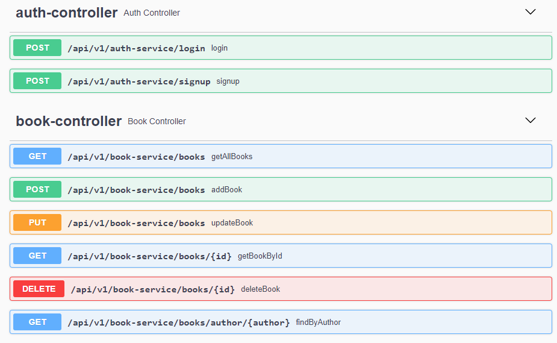

# Online Bookshop

The objective of this assignment is to create the backend service for an online bookshop. Service allows new customers to signup or existing customers to login. Books can be created, updated, deleted or read.

### Problem Statement

Create a Spring Boot API utilising supporting tools, methodologies and technologies that encapsulates modules covered during training. Specifically, creating a Spring Boot API using:

1. An application back-end developed using the Java language.
2. A managed database hosted locally or within a Cloud provider e.g. H2 or MySQL (local / GCP).
3. A means of making API calls (Postman) and a means of checking persistence (Workbench/H2 console).
4. Fully CRUD functional.
5. Create a build (.jar) using an integrated build tool (Maven).
6. Code is tested using relevant technologies (JUnit, Mockito).

### Tech Stack 

1. Java 17.0.5
2. SpringBoot 2.7.5
3. Apache Maven 3.8.6
4. MySQL 8.0.31
5. Project Lombok 1.18.24
6. H2 2.1.214
7. SpringFox (Swagger) 3.0.0
8. Mockito 4.5.1
9. JUnit 5.8.2

### Steps to run the project locally

1. Java. Install JDK 17 from Oracle website (https://www.oracle.com/java/technologies/downloads/).
2. Java. Set relevant environment variables - JAVA_HOME, Path etc.
3. MySQL. Install MySQL community edition (https://www.mysql.com/products/community/).
4. Application. Download jar from GitHub and save to local folder.
5. Application. Open command window / terminal in local folder.
6. Java. Check Java runs and is version 17 (java -version).
7. Application. Start application (java -jar <jarname.jar>).
8. Application. Check Swagger page up (http://localhost:8083/swagger-ui/index.html).

### End Points

```bash
/api/v1/auth-service/login
```
```bash
/api/v1/auth-service/signup
```
```bash
/api/v1/book-service/books
```
```bash
/api/v1/book-service/books/{id}
```

### Database Data

```SQL
insert into t_book (id,author,title) values
(1,'William Shakespeare','Romeo and Juliet'),
(2,'William Shakespeare','Macbeth');
```

### Sample Screens - End Points


### Sample Screens - Model


### Sample Screens - Example
